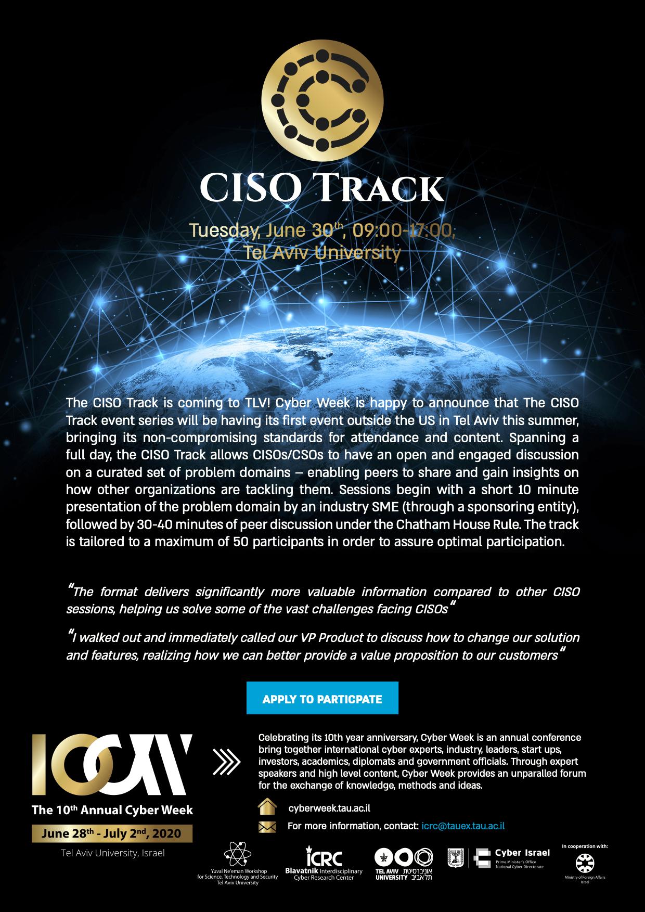

## CyberWeek 2020

UPDATE: Unfortunately, due to the COVID-19 global pandemic, CyberWeek has been cancelled for 2020, and as such the CISO Track will not run alongside it.

We are excited to have been invited to bring The CISO Track to its first international event that will be held during CyberWeek 2020 on June 30th in Tel Aviv, Israel. The event will take place during the second main planery day and will allow participants an opportunity to access other activities during the week (from the [Startup Day](https://cyberweek.tau.ac.il/2020/Events/Startup-Day), through [Team8's CISO Delegation](https://www.rethinkcyber.com), to [BSidesTLV](https://bsidestlv.com/)) in order to maximize the value of their trip to Tel Aviv.

If you'd like to better plan your stay, feel free to get in touch with us, to help secure invitations to the closed events.

