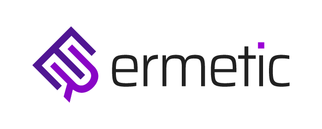
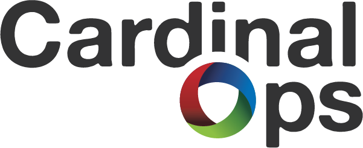
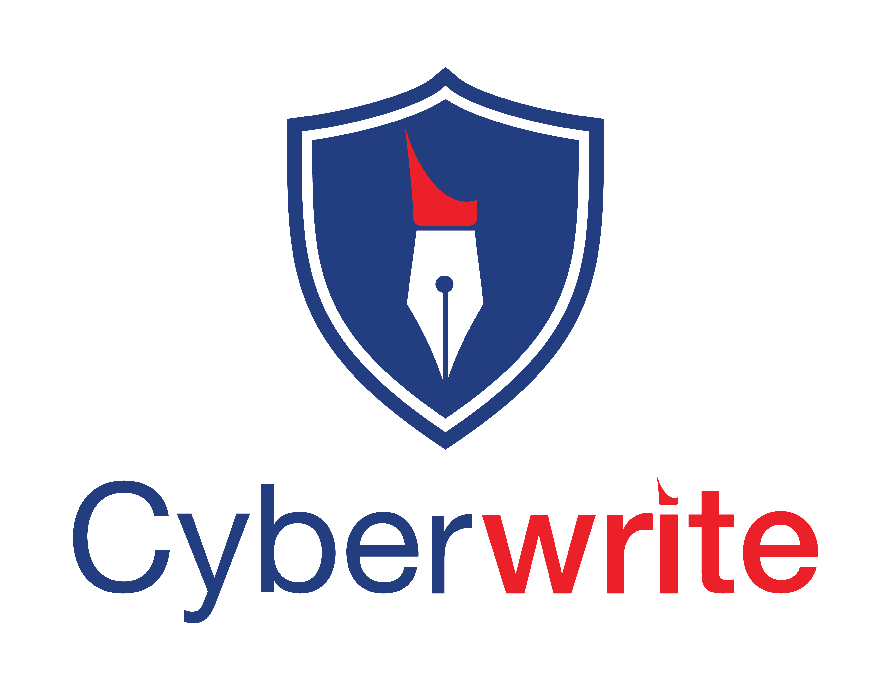

## Tel Aviv Regional CE 

We held a regional CE (Coronavirus Edition) event in Tel Aviv on June 30th (originally planned for CyberWeek) at [Labs TLV](https://labstlv.com/) (Azrieli-Sarona tower).

Note that space will be limited to 10 participants, and we are also reducing the participation price to $100 per participant to account for the smaller event operational overhead.

We will be publishing the event proceedings here and on our main page once they have been edited and vetted.

### Agenda
* Cloud Security - with [ERMetic](https://ermetic.com/) 
* Optimizing Operational Security - with [CardinalOps](http://cardinalops.com/) 
* DevSecOps
* Non-Technical Risk Management - with [CyberWrite](https://www.cyberwrite.com/) 

### What to expect
The CISO Track runs through a full business day (9am to 5pm), and includes networking breaks, as well as a participant-led open session (un-conference style). Throughout the day, we will cover different topics, which would be selected and tailored by the track moderators.

Additionally, we will conduct a participant-led, open session where the content is defined and moderated by participants – this is the un-conference aspect of the program. Throughout the day, participants will suggest topics, and we’ll pick one or two of them to discuss in-depth. The person suggesting the topic will act as moderator.

This ensures that everyone has a chance to learn and lead discussions with their peers. Given the nature of our event, we hope that this hybrid approach will foster thoughtful, open discussion among participants on topics that have been identified as most relevant to them.

Participation in the CISO track is limited to vetted individuals who hold an active full-time CSO/CISO position. The event itself will run  under the Chatham House Rule.

For sponsorship opportunities and inquiries, please see our [sponsors](sponsors) page.

**Note**: For those of you not familiar, Chatham House Rule is defined as follows: “When a meeting, or part thereof, is held under the Chatham House Rule, participants are free to use the information received, but neither the identity nor the affiliation of the speaker(s), nor that of any other participant, may be revealed.”

Participants are expected to be highly engaged and contribute to the discussions held during the day in a meaningful way. The cost of entry to the event is currently $100 per participant, but we reserve the right to modify it based on the location of each event. In order to ensure the effectiveness of this track, participation will be restricted to up to 25 individuals.

Vendor participation is limited to presenting the session topic, and vendors will have no access to any participant list and are restricted from pitching or following-up with participants. The entire day will have a curator who will take notes to produce anonymized proceedings from the track which would focus on the content discussed, and publish the vetted proceedings after the conference.
